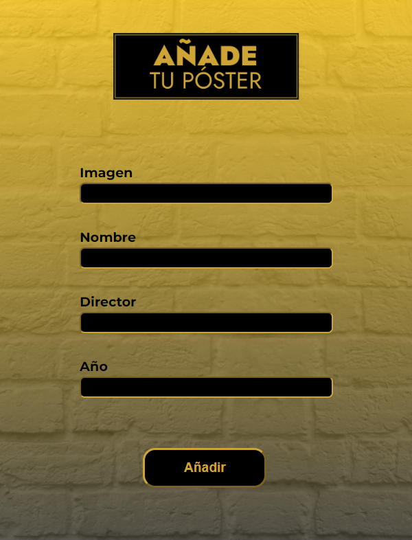

# HOLLYWOW APP

Bienvenida a nuestro proyecto HollyWow App, una aplicación web con la que puedes crear tu propia galería de pósters de cine añadiendo, editando y eliminando cualquiera de las películas que tú elijas. 
 
## CONTENIDO

- [ESTRUCTURA DEL PROYECTO](#ESTRUCTURA-DEL-PROYECTO)
- [TECNOLOGÍAS](#TECNOLOGÍAS)
- [INSTALACIÓN](#INSTALACIÓN)
- [COLABORACIÓN DESEADA](#COLABORACIÓN-DESEADA)
- [DESARROLLADORAS](#DESARROLLADORAS)

## ESTRUCTURA DEL PROYECTO

### Página Principal / Galería:

La página principal o Galería muestra unas cards con los pósters que tenemos en nuestra base de datos. En cada una de ellas encontramos dos botones: 
 - "Eliminar": Nos permite borrar el póster y nos actualiza automáticamente la página mostrando el resto de cards.
 - "+ info": Nos redirije a una página con el detalle del póster seleccionado.


### Página para añadir un nuevo póster:

En la Nav (componente presente en todas las páginas de nuestra aplicación) encontramos en la parte derecha un botón llamado "Añadir póster":


Al hacer clic en ese botón, nos redirije a nuestro formulario de "Añade tu póster":



Una vez rellenados todos los campos, pulsando el botón de la parte inferior del formulario "Añadir" nos redirijirá automáticamente a nuestra página principal y nos mostrará la galería con el nuevo póster.

### Página de detalle:

Para acceder al detalle de un póster se debe hacer clic en el botón "+ info" de la card. 

Dentro de esta, nos mostrará los datos de "imagen" y "nombre" del póster y, además, los datos extra de "director" y "año". Además de dos botones: "Editar" y "Eliminar" (hacienco clic en este último, podríamos eliminar el póster y automáticamente volver a la página principal).


### Página de Editar:

Se accede desde la página detalle del póster que queremos editar. 


Permite realizar modificaciones y guardar los cambios mediante el método PUT..


## LENGUAJES Y HERRAMIENTAS UTILIZADAS

## INSTALACIÓN

### Instalación de Dependencias:
1. Comprueba que tienes Node.js instalado.
2. Ejecuta el siguiente comando para instalar las dependencias del proyecto:
```bash
npm install
```

### Iniciar la API Simulada:
Utiliza json-server para simular una API.
```bash
npm run api
```

### Iniciar el Servidor de Desarrollo:
```bash
npm run dev
```

## COLABORACIÓN DESEADA

## DESARROLLADORAS
- Scrum Master: [Andrea](https://github.com/Andreamartinn17)
- Product Owner: [Lucero](https://github.com/LuHeRiver)
- Web developer: [Alba](https://github.com/albamartinmz)
- Web developer: [Rebeca](https://github.com/rebecavm28)